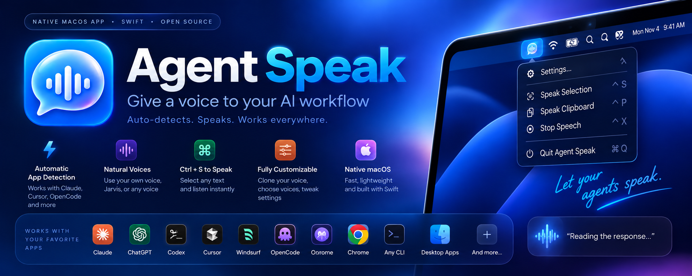
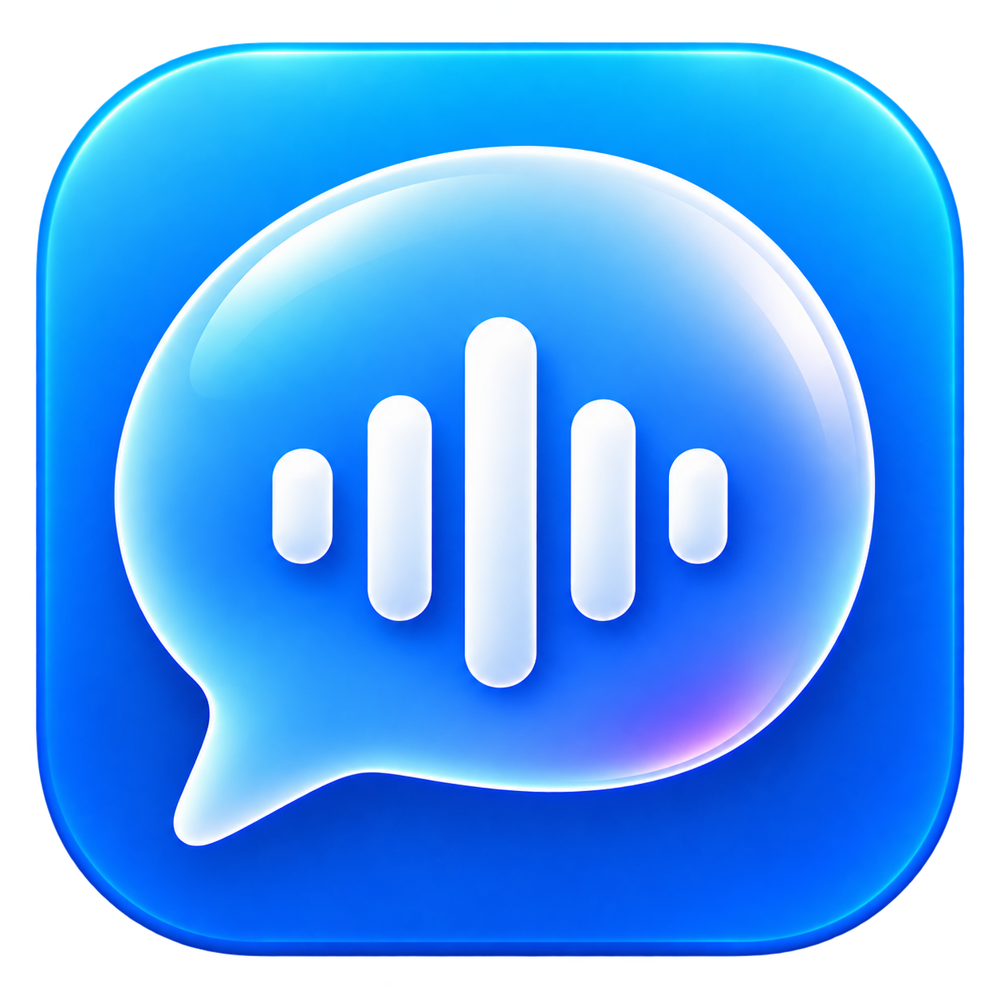

# <div align="center">





# Agent Speak
### The Liquid Glass Voice Companion for AI Coding Agents on macOS

[](https://apple.com)
[](https://swift.org)
[](#notch-player)
[](#dual-engine-architecture)
[](#voice-cloning-studio)
[](LICENSE)

<p align="center">
  <b>Give your AI coding agents a voice without burning CPU or sacrificing privacy.</b><br>
  Agent Speak docks fluidly under your MacBook Pro notch at 120 FPS, watches your active agent sessions in real time, and brings voice cloning, system hotkeys, and ambient focus music into one unified native macOS app.
</p>

[Key Highlights](#-key-highlights) •
[Video Walkthrough](#-video-walkthrough) •
[Quick Start](#-quick-start) •
[Global Hotkeys](#-global-hotkeys) •
[Agent Integration](#-agent-integration) •
[Architecture](#-architecture)

---

</div>

## 🎬 Video Walkthrough

<div align="center">

<!-- VIDEO EMBED PLACEHOLDER: Replace the link and preview image below once your demo is recorded -->
<a href="https://www.youtube.com" target="_blank">
  
</a>

<p><i>▶️ Click to watch the full walkthrough: 120 FPS Notch Animation, Voice Cloning Studio, and Hotkeys in action.</i></p>

</div>

---

## 🌟 Key Highlights

### 🛸 Liquid Glass Notch Player (120 FPS ProMotion)
- **Zero-Flicker Hardware Synced**: Driven by native `CADisplayLink` at 120 frames per second on Apple Silicon displays.
- **Dynamic Display Adaptability**: Hugs your physical camera notch with zero-radius top corners, or gently floats as an elegant pill on external monitors.
- **Real-Time Audio Waveform**: Animated frequency bars react directly to speech audio output.
- **Instant Controls**: Interactive pause, skip, replay, and speed toggles at your fingertips.

### ⚡ Dual Engine Architecture
- **Zero-CPU Native Engine**: Built directly on Apple AVFoundation speech synthesis. Ultra-low battery draw, near-zero RAM footprint, and instant spoken response.
- **Pocket-TTS Offline Neural Extension**: 100% on-device neural voice cloning. Zero cloud calls, zero monthly subscriptions, and complete offline privacy.

### 🎙️ Built-in Voice Cloning Studio
- **1-Click Waveform Trimming**: Drop in any short voice recording (10 to 25 seconds).
- **Auto-Speech Detection**: Automatically locates the cleanest speech window or lets you scrub custom timestamps.
- **Instant Auditioning**: Test synthesized clone previews directly before activating across your workflows.

### ⌨️ Global Productivity Hotkeys
- `Control + S`: Read highlighted text aloud from any application (Safari, Chrome, Xcode, VS Code, Slack, PDF viewer).
- `Control + P`: Read current clipboard contents aloud.
- `Escape`: Low-level macOS event tap that instantly silences playback in zero milliseconds without switching focus.

### 🤖 Automatic Multi-Agent Watching
- **Antigravity IDE**: Continuous live transcript scanning.
- **Claude Code & Claude Desktop**: Automatic project session discovery.
- **OpenCode, Cursor, Windsurf & Aider**: Automatic tail watching.
- **Terminal CLI & IPC Socket**: Direct high-speed pipe via `/tmp/agentspeak.sock`.

### 🎵 Ambient Focus Soundtrack
- Integrated ambient background music engine that plays during thinking and speaking phases.
- Smart auto-ducking with smooth logarithmic cross-fading and 2.5-second spatial reverb tails.

### 🎛️ Raycast-Grade Settings Dashboard
- High-craft SwiftUI preferences window designed with native macOS vibrancy.
- Quick audio device routing, customizable keybindings, speech rate, pitch, and agent directory toggles.

---

## 🚀 Quick Start

### 1-Line Terminal Installation

Clone the repository and run the setup script:

```bash
git clone https://github.com/sayedjohon/agent-speak.git
cd agent-speak
./install.sh
```

The installer will:
1. Compile the native Swift application and CLI tool with optimization flags.
2. Link the binary to your system path (`/usr/local/bin/agentspeak`).
3. Set up the launch daemon so Agent Speak starts seamlessly upon user login.
4. Launch the application immediately in your menu bar.

---

## ⌨️ Global Hotkeys

| Shortcut | Function | Description |
| :--- | :--- | :--- |
| **`Control + S`** | **Speak Selected Text** | Highlight any paragraph in any app and speak it immediately. |
| **`Control + P`** | **Speak Clipboard** | Speaks whatever text is currently stored in your clipboard buffer. |
| **`Escape`** | **Instant Dismissal** | Instantly stops playback and retracts the notch player to zero size. |

---

## 💻 Developer CLI (`agentspeak`)

Agent Speak includes a dedicated command-line controller aliased to `agentspeak` and `aspk`:

```bash
# Verify daemon health and engine state
agentspeak status

# Speak custom text using the active voice engine
agentspeak say "Deployment completed successfully in 42 seconds."

# Open the visual settings dashboard
agentspeak dashboard

# Immediately silence any active playback
agentspeak stop

# Toggle between Zero-CPU mode and Pocket-TTS Neural mode
agentspeak engine toggle

# Safely terminate the background daemon
agentspeak quit
```

---

## 🤖 Agent Integration

To make your AI coding assistants speak naturally without awkward punctuation or reading code blocks, configure them with voice-first rules:

### Antigravity (`AGENTS.md`)
Add this protocol to your repository root `AGENTS.md`:

```markdown
## 🎙️ Global Voice & Audio Protocol
- All conversational responses are spoken aloud via Agent Speak.
- Write naturally for the human ear (conversational, spoken tone).
- STRICT QUARANTINE: Never write code, terminal commands, or filepaths inline within prose.
- Place all code blocks strictly inside triple-backtick fenced blocks (```) so the player skips them.
```

### Claude Code (`CLAUDE.md`)
Add this snippet to your `CLAUDE.md`:

```markdown
## Voice Protocol (Agent Speak)
- Format conversational output for text-to-speech listening.
- Keep spoken text concise and natural.
- Place all code, file modifications, and CLI commands exclusively inside fenced code blocks.
```

### OpenCode & Aider
Include this instruction in your system prompt:

```markdown
Spoken audio output is active. Format all explanations as natural conversational speech. Isolate all technical code, syntax, and paths inside markdown fenced code blocks.
```

---

## 🏗️ Architecture

```mermaid
flowchart TD
    subgraph Input Sources
        A1[Antigravity Watcher] --> IPC[/tmp/agentspeak.sock]
        A2[Claude Code Watcher] --> IPC
        A3[Selected Text Hotkey] --> IPC
        A4[CLI: agentspeak say] --> IPC
    end

    subgraph Core Engine [Agent Speak Daemon]
        IPC --> Sanitizer[Text Sanitizer & Code Stripper]
        Sanitizer --> Queue[Speech Queue Manager]
        Queue --> EnginePicker{Engine Active?}
        EnginePicker -->|Zero CPU| AppleTTS[AVFoundation Native Voice]
        EnginePicker -->|Neural| PocketTTS[Pocket-TTS Offline Cloner]
        Queue --> BGM[Ambient Soundtrack Cross-Fader]
    end

    subgraph Visual Interface
        Queue --> NotchController[120 FPS Notch Window Controller]
        NotchController --> ProMotion[MacBook Notch / Floating Pill]
        NotchController --> Waveform[Real-Time Frequency Visualizer]
    end
```

---

## 📁 Codebase Layout

```
agent-speak/
├── docs/
│   └── assets/                  # High-resolution branding banner & logo
├── Resources/
│   ├── Agent-Speak-Banner.png   # Local banner asset
│   ├── Agent-Speak-logo.png     # Local application icon
│   ├── bgm/                     # Ambient focus music tracks
│   └── voices/                  # Neural cloned voice reference profiles
├── Sources/
│   ├── main.swift               # Application entry point & lifecycle
│   ├── AppDelegate.swift        # Menu bar status item & event coordinator
│   ├── DashboardView.swift      # Modern tabbed settings dashboard
│   ├── NotchWindowController.swift # 120 FPS Liquid Glass notch HUD
│   ├── PocketTTSExtensionCardView.swift # Pocket-TTS neural engine manager
│   ├── VoiceCloningStudioView.swift     # Interactive voice cloner studio
│   ├── AudioWaveformTrimmerView.swift   # Pocket TTS style waveform track & cut tool
│   ├── TranscriptWatcher.swift  # Auto-agent file watching engine
│   ├── TextSanitizer.swift      # Markdown & code block quarantine parser
│   ├── SpeechQueueManager.swift # Thread-safe audio speech queue
│   └── AudioEngine.swift        # Low-level core audio routing
├── CLI/
│   └── main.swift               # Native Swift command-line controller
├── rules/
│   ├── AGENTS.md                # Agent instruction template
│   └── CLAUDE.md                # Claude Code instruction template
├── install.sh                   # Native build & installation script
└── uninstall.sh                 # Clean system uninstaller
```

---

## 🔒 Privacy & On-Device Security

- **100% Local Execution**: All synthesis and neural inference occur strictly on your Apple Silicon hardware.
- **Zero Cloud Network Calls**: Audio never leaves your machine.
- **Zero Third-Party Telemetry**: No analytics, trackers, or hidden pingbacks.
- **Single macOS Permission**: Configured entirely within standard macOS accessibility and input monitoring permissions.

---

## 📄 License

Agent Speak is open-source software licensed under the [MIT License](LICENSE).
