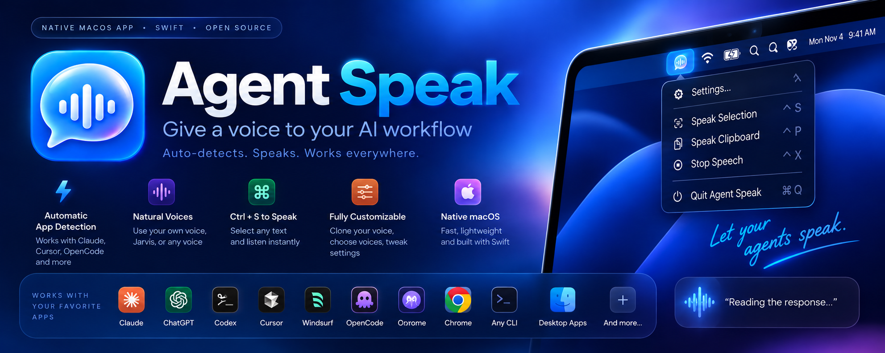
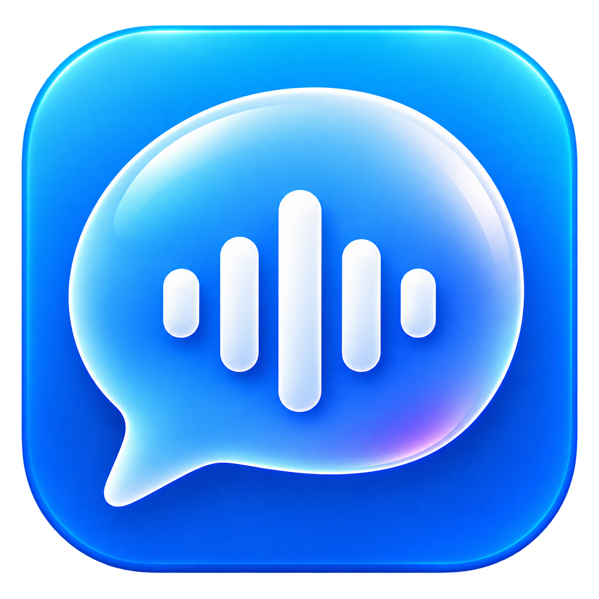

# <div align="center">





# Agent Speak
### Real-Life Jarvis for AI Coding Agents on macOS

[](https://apple.com)
[](https://swift.org)
[](#-works-instantly-with-your-favorite-ai-tools)
[](#-built-for-speed-on-apple-silicon)
[](#-offline-voice-cloning-in-10-seconds)
[](https://github.com/sayedjohon/Agent-Speak/releases)
[](LICENSE)

<p align="center">
  <b>Give your AI coding agents a real human voice.</b><br>
  You code. Your AI agent works. Agent Speak reads its answers out loud so you never have to stop and read long walls of text again.<br>
  Built natively for macOS with offline voice cloning, push-to-talk dictation, holographic HUD, and touchless hand gestures.
</p>

[Download DMG](#-download--installation) •
[Why Developers Love It](#-why-developers-love-it) •
[Feature Tour](#-feature-tour) •
[Global Hotkeys](#-global-hotkeys) •
[Developer CLI](#-developer-cli-agentspeak--aspk) •
[Agent Setup](#-agent-integration--voice-first-protocol) •
[Privacy Guarantee](#-100-private--on-device)

---

</div>

## 🌟 Why Developers Love It

| What You Get | How It Helps You | Where It Runs |
| :--- | :--- | :--- |
| **🗣️ Real AI Agent Voice** | Automatically speaks answers from Antigravity, Claude Code, Cursor, and terminals. Skips code blocks so you only hear the explanation. | 100% Local on Mac |
| **🧬 Offline Voice Cloning** | Clone any voice in 10 seconds (Jarvis, Storyteller, or your own voice). Zero cloud fees, zero subscriptions. | Apple Silicon Neural Engine |
| **🎤 Push-to-Talk Dictation** | Hold Right Option (or Fn, Ctrl) and talk. Transcribes instantly and types right where your cursor is. If network drops, audio is preserved with 1-click Notch Bar retry and clipboard copy. | Groq Whisper + Local Fallback |
| **⚛️ Holographic Arc Reactor** | Floating Iron Man visualizer with DaVinci Resolve-style 3-axis zoom and position sliders. | Metal GPU Overlay |
| **🖐️ Touchless Hand Gestures** | Pinch to click, move two fingers to scroll, and hold a fist to dictate hands-free via your Mac camera. | Apple Vision Neural Engine |
| **🎵 Dynamic Focus Music** | Ambient Iron Man soundtrack that plays while your agent thinks and auto-ducks the moment it speaks. | Native CoreAudio |

---

## 📦 Download & Installation

### Option 1: Download Pre-Built DMG (Recommended)

1. Download the latest **`Agent-Speak.dmg`** from the [**GitHub Releases**](https://github.com/sayedjohon/Agent-Speak/releases) page.
2. Open the disk image and drag **`Agent Speak.app`** into your **`Applications`** folder.
3. **First-Time Open (Gatekeeper Helper)**:
   - Double-click the **`Setup & Bypass Gatekeeper.command`** helper inside the DMG.
   - *Or run this quick command in Terminal:*
     ```bash
     xattr -cr "/Applications/Agent Speak.app"
     ```
4. Open **Agent Speak** from your Applications folder. It docks neatly under your display notch and starts working right away.

---

### Option 2: Build from Source (1-Click Terminal Setup)

If you prefer building directly from source on your Mac:

```bash
git clone https://github.com/sayedjohon/Agent-Speak.git
cd Agent-Speak
./install.sh
```

The installer takes care of everything:
1. Compiles the native Swift application and CLI using the Apple Silicon compiler.
2. Signs the app bundle locally and sets up macOS permissions.
3. Links the `agentspeak` and `aspk` CLI commands to your path.
4. Registers a lightweight background service that starts automatically when you log in.

---

## 🚀 Works Instantly with Your Favorite AI Tools

Agent Speak watches your active agent sessions in real time. Whenever an agent finishes writing or thinking, Agent Speak reads the answer to you.

```
┌────────────────────────────────────────────────────────┐
│  Antigravity • Claude Code • Cursor • Windsurf • CLI   │
└──────────────────────────┬─────────────────────────────┘
                           │ Active Session Stream
                           ▼
┌────────────────────────────────────────────────────────┐
│                     Agent Speak                        │
│   • Quarantines code blocks (never speaks raw syntax)  │
│   • Synthesizes natural human speech in real time      │
│   • Pulses the 120 FPS notch player & Iron Man HUD     │
└────────────────────────────────────────────────────────┘
```

- **Smart Code Quarantine**: It automatically detects code blocks, shell commands, tables, and links. It speaks only the human explanation, keeping code blocks completely muted so you can copy and paste without voice interruptions.
- **Dual-Transcript Ingestion**: Never clips long answers. It reads the full output so you get every detail.
- **Universal Connectors**: Works with Google Antigravity, Claude Code, Cursor, Windsurf, Roo Code, Cline, Aider, and custom terminal scripts.

---

## ✨ Feature Tour

### 🎙️ Real-Life Jarvis Voice
Give your Mac the personality of Tony Stark's assistant, a natural podcast host, or a calm narrator. Choose from 24 ready-to-use personas or use your macOS system voices.

### 🧬 Offline Voice Cloning in 10 Seconds
Want your assistant to sound like you? Drop in any 10-to-25 second audio clip, scrub the waveform trimmer, and click clone.
- Runs 100% offline using Kyutai FlowLM models on your Apple Silicon chip.
- Zero cloud calls. Zero monthly subscriptions. Complete privacy.

### 🎤 Push-to-Talk Hardware Dictation
Never take your hands off the keyboard to switch apps.
- Hold **Right Option** (or configure it to **Fn**, **Right Control**, **Command**, or **Shift**) and speak your prompt.
- High-speed transcription types your words directly into your active code editor or terminal.
- Single-channel event engine ensures **zero double-paste bugs** across VS Code, Antigravity, Electron, and native macOS text fields.

### ⚛️ Holographic Arc Reactor HUD (DaVinci Resolve Controls)
A cinema-grade floating visualizer that pulses on your screen when your agent thinks and speaks:
- **Click-Through Transparency**: Clicks pass right through it so it never blocks your work.
- **3-Axis DaVinci Controls**: Use precision sliders for Zoom (Scale Z up to 2.8x), Horizontal Position X (-1000px to +1000px), and Vertical Position Y (-800px to +800px).
- **Master Reset Button**: One click snaps everything back to default.
- **7 Blending Modes**: Screen, Additive, Multiply, Overlay, Color Dodge, Luminosity, and Normal.
- **6 Color Themes**: Golden Amber (Stark Mk 42), Arc Reactor Cyan, Matrix Emerald, Crimson Ruby, Neon Violet, and Diamond Ice.
- **Smart Preview**: 5-second auto-exit test preview with a dynamic red Stop button.

### 🖐️ Touchless Camera Hand Gestures
Control your computer hands-free using your Mac's built-in FaceTime camera:
- **Point & Move**: Jitter-free cursor flight powered by Apple Vision neural tracking.
- **Pinch**: Left click.
- **Pinch & Hold**: Drag windows, select text, or move files.
- **Two-Finger Slide**: Scroll up and down smoothly through code and web pages.
- **Fist Hold**: Trigger voice dictation hands-free.
- Press **`Control + G`** anytime to turn camera tracking on or off.

### 🎵 Ambient Focus Soundtrack
Coding with music helps you stay in the zone.
- Built-in Iron Man and ambient focus soundtrack that plays softly in the background.
- **Smart Auto-Ducking**: Automatically lowers music volume the exact millisecond your agent speaks, and brings it back up smoothly when speech ends.

---

## ⌨️ Global Hotkeys

| Shortcut | Action | What It Does |
| :--- | :--- | :--- |
| **`Control + S`** | **Speak Selection** | Highlight any paragraph of text and hear it spoken out loud instantly. |
| **`Control + P`** | **Speak Clipboard** | Reads whatever text is currently copied to your clipboard. |
| **`Control + R`** | **Re-listen / Replay** | Instantly re-listens to the last spoken or interrupted speech segment. |
| **`Control + G`** | **Toggle Gestures** | Turns camera hand tracking on or off without opening settings. |
| **`Right Option` (Hold)** | **Push-to-Talk** | Hold to record your voice; release to type text into your active window. |
| **`Escape`** | **Instant Silence** | Instantly stops speech and dismisses the notch player. |

*(All hotkeys and the push-to-talk trigger key can be customized in the Settings Dashboard).*

---

## 💻 Developer CLI (`agentspeak` / `aspk`)

Control Agent Speak from any terminal, script, or agent workflow:

```bash
# Check service health and engine status
agentspeak status

# Speak custom text out loud
agentspeak say "Deployment finished. All unit tests passed."

# Read highlighted text or clipboard
agentspeak selected
agentspeak pb

# Open the settings dashboard
agentspeak dashboard

# Holographic Arc Reactor controls
agentspeak hologram on
agentspeak hologram off
agentspeak hologram blend screen     # normal, screen, additive, multiply, overlay, colordodge, luminosity
agentspeak hologram zoom 0.5         # set scale / zoom (0.0 to 1.0, 0.5 = 100% normal)
agentspeak hologram pos 0 0          # set X and Y pixel offsets
agentspeak hologram reset            # reset HUD transform to factory defaults
agentspeak hologram preview          # 5-second live visualizer test
agentspeak hologram stop             # instantly dismiss preview

# Push-to-Talk Dictation
agentspeak dictation status
agentspeak dictation key right-opt   # right-opt, fn, right-ctrl, cmd, shift, f12, grave
agentspeak dictation retry           # retry failed transcription & copy text to clipboard

# Camera Hand Tracking
agentspeak gesture on
agentspeak gesture off
agentspeak gesture toggle

# Voice Engine & Personas
agentspeak voice list                # list all 24 neural and system voices
agentspeak voice set Jarvis_Best
agentspeak voice vol 120             # volume from 1 to 200%

# Background Focus Music
agentspeak bgm on
agentspeak bgm off
agentspeak bgm vol 30

# Silence & Lifecycle
agentspeak replay                    # re-listen to last spoken or interrupted segment
agentspeak stop                      # stop speech immediately
agentspeak quit                      # stop the background service
```

---

## 🤖 Agent Integration & Voice-First Protocol

To give your AI coding assistant a natural voice that explains solutions without reading raw code syntax aloud, add this block to your agent's system prompt (e.g. `CLAUDE.md`, `.cursorrules`, `AGENTS.md`, or project instructions):

```markdown
# Voice-First & Text-to-Speech Output Protocol (Agent Speak)

- **Voice-First Prose (Text-to-Speech Optimized)**:
  All conversational text is automatically read aloud by macOS Text-to-Speech and Agent Speak. Every message MUST be written purely for the human ear (natural spoken English, as if talking on a call).
  - Speak in a concise, warm, natural tone.
  - Never read out raw URLs, long directory paths, camelCase code words, or technical symbols in spoken sentences.

- **Strict Code & Command Quarantine (CRITICAL RULE)**:
  - NEVER write code snippets, terminal commands, file paths, programming syntax, or technical symbols inline inside conversational sentences or paragraphs.
  - Whenever code, scripts, or terminal commands are necessary, ALWAYS place them strictly inside isolated Markdown fenced code blocks (```).
  - The voice reader automatically skips and mutes all code blocks completely, allowing the user to copy/paste without interrupting the spoken voice.

- **Digestible Formatting**:
  - Use bullet points or tables for key updates, status items, and suggested options.
  - Keep conversational explanations concise and actionable.
```

*(See [SYSTEM_PROMPT.md](SYSTEM_PROMPT.md) for full configuration guides across Cursor, Claude Code, and Antigravity).*

---

## 🔒 100% Private & On-Device

Your code and your voice are private. Agent Speak is designed with privacy as the core foundation:
- **100% Local Execution**: Speech synthesis, neural voice cloning, and camera vision tracking run completely on your Mac.
- **Zero Cloud Network Calls**: Your code, transcripts, and voice embeddings never leave your computer.
- **Zero Tracking**: No telemetry, no usage analytics, and no tracking cookies.
- **Sandboxed Storage**: All settings and voice profiles live strictly in `~/.agentspeak/`. It never touches your personal documents.

---

## 🛡️ macOS Permissions & Gatekeeper

Because Agent Speak is an open-source, independently distributed app, macOS Gatekeeper may show a notice on first launch:
*"Agent Speak is damaged and can't be opened"* or *"cannot be opened because it is from an unidentified developer"*.

### 1-Click Fix
Double-click the **`Setup & Bypass Gatekeeper.command`** helper included inside the DMG.

### Or Run in Terminal
```bash
xattr -cr "/Applications/Agent Speak.app"
```

### System Permissions
Open **macOS System Settings > Privacy & Security**:
- **Accessibility**: Needed for global hotkeys (`Control+S`, `Control+P`, and `Escape`).
- **Microphone**: Needed only if you use Push-to-Talk dictation.
- **Camera**: Needed only if you turn on touchless hand gestures.

---

## 📄 License

Agent Speak is open-source software licensed under the [MIT License](LICENSE).
